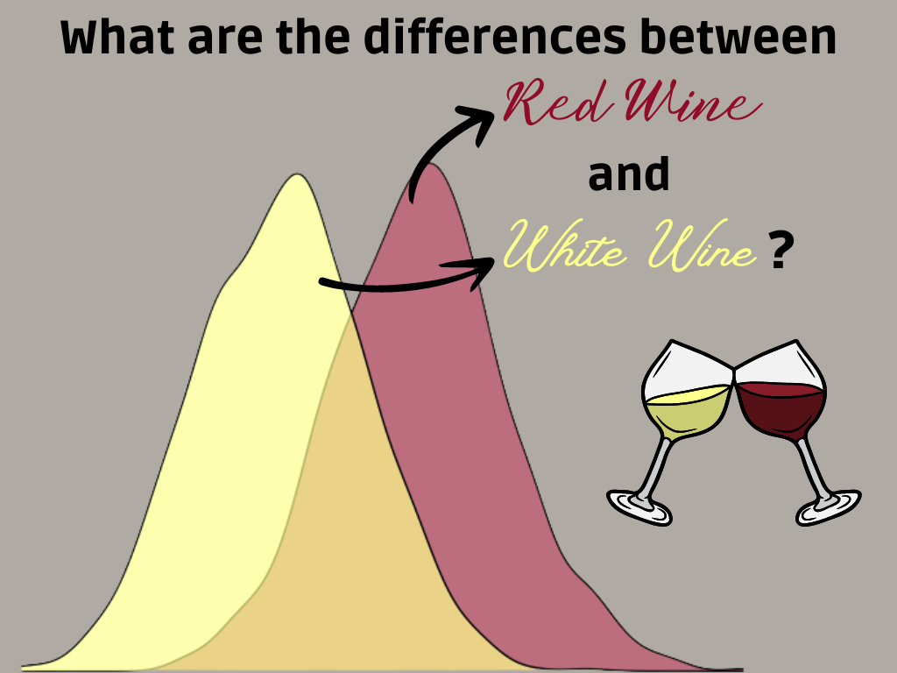

# Red vs White Wine Quality

### Analysing the differences in red and white wine composition and evaluating how they affect the quality of the wine.

***

## Dataset 📚

The datasets analysed about red and white wine were created by Paulo Cortez, Antonio Cerdeira, Fernando Almeida, Telmo Matos and Jose Reis, the wines studied are the Portuguese "Vinho Verde" in its red and white variant, downloaded from [here](https://docs.google.com/document/d/1qEcwltBMlRYZT-l699-71TzInWfk4W9q5rTCSvDVMpc/pub). The following variables were taken into consideration:

1. Fixed Acidity.
2. Volatile Acidity.
3. Citric Acid.
4. Residual Sugar.
5. Chlorides.
6. Free Sulfur Dioxide.
7. Total Sulfur Dioxide.
8. Density.
9. pH.
10. Sulphates.
11. Alcohol.
12. Quality

***

## Contributing 🖇️

Any contributions are highly appreciated. There are two things you can do:

1. Create an issue explaining your idea.
2. Fork the project and submit a Pull Request with your idea already developed explaining it in detail.

⌨️ with ❤️ by [Ukliz](https://github.com/Uklizdev) 😊
